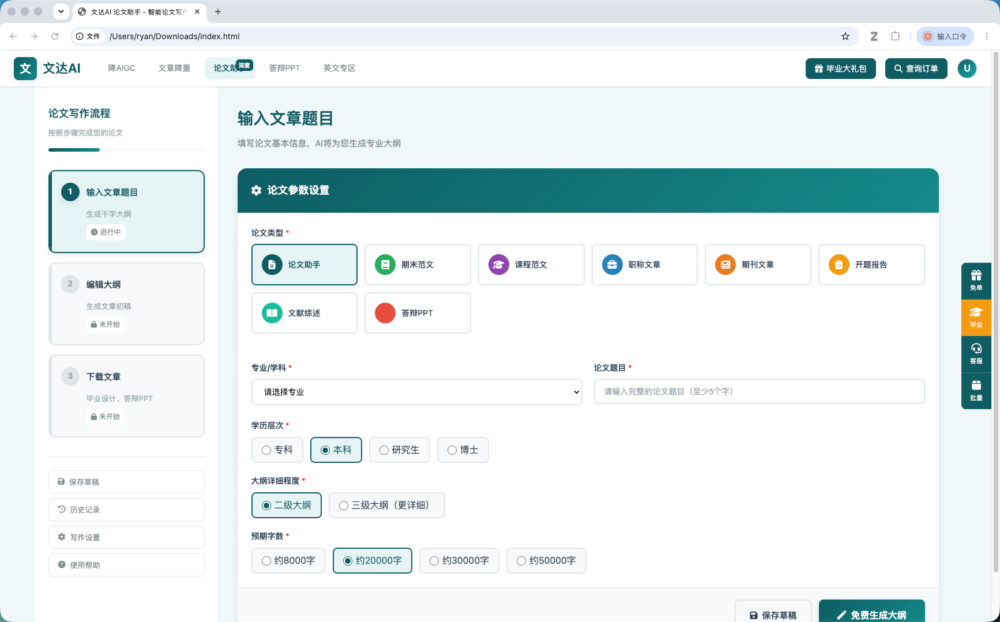
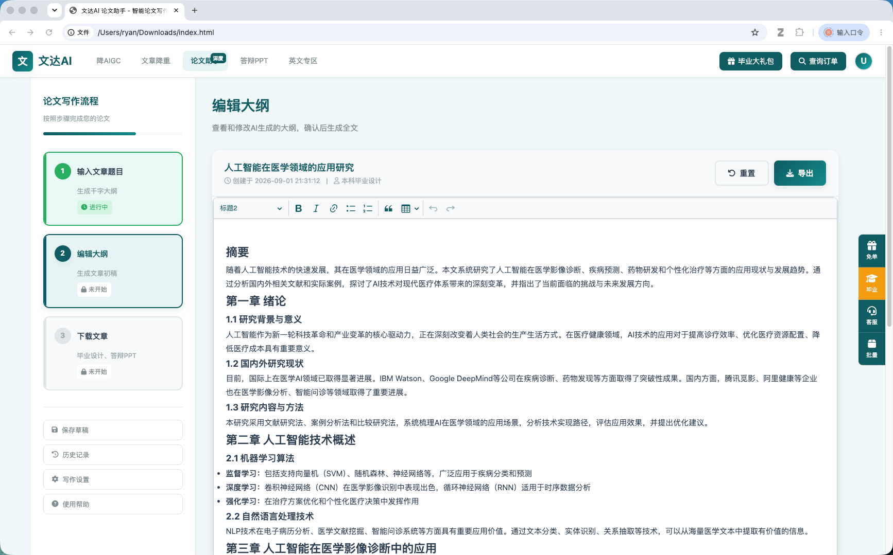
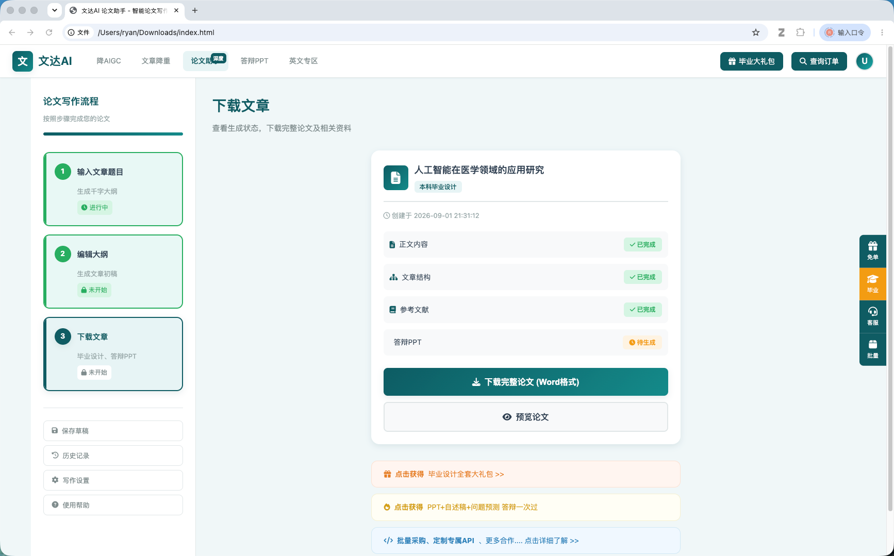

# VersaBot-AI

> **面向 AI 学术科研工具的开源 UI 与应用基础设施**
> **Open-source UI and infrastructure for AI-powered academic research tools.**



VersaBot-AI 致力于提供一个开放、可扩展的基础，用于构建下一代 AI 学术科研应用。

VersaBot-AI aims to provide an open and extensible foundation for building the next generation of AI-powered academic research applications.

[在线体验 / Live Demo](https://www.versabot.cn/ui/index.html) · [文档 / Documentation](https://www.versabot.cn/ui/index.html) · [API 文档 / API Docs](https://www.versabot.cn/ui/index.html) · [路线图 / Roadmap](#-路线图--roadmap) · [讨论 / Discussions](#-社区--community)

---

## 📌 项目简介 | What is VersaBot-AI?

**VersaBot-AI** 是一个面向 AI 学术科研场景的开源项目，专注于构建现代化、可扩展的科研工作界面与应用基础设施。

**VersaBot-AI** is an open-source project focused on building modern and extensible interfaces and infrastructure for AI-powered academic research workflows.

项目当前从科研写作与研究工作空间开始，并将逐步扩展到：

The project currently starts with research writing and workspace experiences, and will progressively expand into:

* 🔎 学术搜索 / Academic Search
* 📚 文献管理与文献综述 / Literature Management & Review
* 📄 PDF 智能阅读 / Intelligent PDF Reading
* 🧠 AI 文献分析 / AI Literature Analysis
* 🔗 引用与证据管理 / Citation & Evidence
* 🤖 Research Agent / AI Research Agent
* ⚙️ AI Research Workflow / AI Research Workflow
* 🔌 API 与后端基础设施 / APIs & Backend Infrastructure

> **This is only the beginning.**
>
> VersaBot-AI will be open-sourced progressively as more components become stable and reusable.

---

## 🌟 为什么开源？ | Why Open Source?

AI 正在改变科研人员获取信息、阅读文献、分析证据和撰写论文的方式，但目前大量 AI 科研工具仍然以封闭平台的形式存在。

AI is changing how researchers discover information, read papers, analyze evidence, and write research. However, many AI research tools are still built as closed platforms.

我们相信：

We believe that developers and research teams should be able to:

* 自由构建自己的科研工作流
* Build their own research workflows
* 根据研究场景定制 AI 能力
* Customize AI capabilities for specific research needs
* 将不同的模型、数据源和工具进行组合
* Combine different models, data sources, and tools
* 在高校、实验室和企业内部部署科研工具
* Deploy research applications within universities, labs, and organizations
* 共同探索 AI × Research 的新应用形态
* Experiment with new AI × Research applications together

**VersaBot-AI 希望成为构建这些应用的开放基础。**

**VersaBot-AI aims to become an open foundation for building these applications.**

---

## 🧩 你可以用 VersaBot-AI 构建什么？ | What Can You Build?

VersaBot-AI 不仅适用于 AI 写作。

It is designed to go beyond AI writing.

你可以基于 VersaBot-AI 构建：

You can use VersaBot-AI to build:

| 应用方向                   | Application                      |
| ---------------------- | -------------------------------- |
| 🔎 AI 学术搜索引擎           | AI Academic Search Engine        |
| 📚 文献综述助手              | Literature Review Assistant      |
| 📄 AI PDF 阅读器          | AI PDF Reader                    |
| 🧠 文献分析工具              | Literature Analysis Tool         |
| 🔗 引用与证据助手             | Citation & Evidence Assistant    |
| ✍️ AI 学术写作工具           | AI Academic Writing Tool         |
| 🏥 医学文献研究工具            | Medical Literature Research Tool |
| 🤖 AI Research Copilot | AI Research Copilot              |
| 🤖 Research Agent      | Autonomous Research Agent        |
| 🧪 自定义科研工作流            | Custom Research Workflow         |

---

# ✨ 核心能力 | Features

## 1. 🔬 Research Workspace

现代化的科研工作空间，为后续 AI 搜索、文献分析、PDF 阅读和写作功能提供统一的交互基础。

A modern research workspace designed to provide a unified interface for AI search, literature analysis, PDF reading, and research writing.

* 双栏科研工作区 / Split-panel research workspace
* 响应式布局 / Responsive layout
* 研究内容与编辑器结合 / Research workspace + editor
* 模块化 UI / Modular UI components
* 面向科研场景设计 / Designed for research workflows

---

## 2. ✍️ Academic Writing Interface

基于 CKEditor 5 构建的现代化学术写作界面。

A modern academic writing interface powered by CKEditor 5.

当前支持：

Current capabilities include:

* 富文本编辑 / Rich-text editing
* 标题与层级结构 / Headings and document structure
* 格式化工具栏 / Formatting toolbar
* 字数统计 / Word count
* 自动保存 / Auto-save
* HTML 内容导出 / HTML export
* 响应式编辑体验 / Responsive editing experience

---

## 3. 🧠 AI-Assisted Research Workflow

项目目前从科研写作工作流开始，并逐步向完整的 AI Research Workflow 扩展。

The project currently starts with an AI-assisted research writing workflow and will progressively evolve toward a broader AI Research Workflow.

典型流程：

Typical workflow:

```text
Research Question
      ↓
Research Outline
      ↓
AI-assisted Writing
      ↓
Editing & Refinement
      ↓
Export
```

未来将进一步扩展：

Future workflow components will include:

```text
Research Question
      ↓
Academic Search
      ↓
Literature Screening
      ↓
PDF Analysis
      ↓
Evidence Extraction
      ↓
Literature Review
      ↓
Research Writing
      ↓
Citation & References
      ↓
Research Report
```

---

## 4. 📱 Responsive Design

VersaBot-AI 针对不同设备进行了响应式设计。

VersaBot-AI is designed to provide a consistent experience across different screen sizes.

支持：

Supports:

* 🖥️ Desktop
* 💻 Laptop
* 📱 Tablet
* 📱 Mobile

---

# 🎬 Demo

> 建议这里放置一个 20–40 秒的 GIF 或视频，展示完整操作流程。

> We recommend adding a 20–40 second GIF or video demonstrating the core workflow.

建议 Demo：

Recommended demo:

```text
Open VersaBot-AI
      ↓
Enter a research topic
      ↓
Generate / edit an outline
      ↓
Open the writing workspace
      ↓
Edit content
      ↓
Export
```

---

# 🖼️ Screenshots

### **步骤一：输入文章题目**

填写科研基本信息，包括科研类型、专业学科、科研题目、学历层次、大纲详细程度和预期字数等参数。


**功能特点：**
- 📝 8种科研类型选择（科研助手、期末范文、课程范文等）
- 🎓 4个学历层次（专科、本科、研究生、博士）
- 📏 灵活的字数设置（8000-50000字）
- 🎯 二级/三级大纲选择

---

### **步骤二：编辑大纲**

查看和修改AI生成的科研大纲，使用CKEditor 5富文本编辑器进行精细化编辑。



**功能特点：**
- ✨ 智能生成完整科研大纲结构
-  富文本编辑（标题、粗体、列表、表格等）
- 📊 实时字数和字符数统计
-  自动保存草稿功能
-  支持导出HTML格式
-  一键重置内容

---

### **步骤三：下载文章**

查看生成状态，下载完整科研及相关资料（Word、PDF、PPT等格式）。



**功能特点：**
- ✅ 实时显示各部分完成状态
- 📥 多格式下载支持（Word、PDF）
-  毕业设计全套大礼包
-  答辩PPT自动生成
-  AIGC痕迹降低工具

---

# 🗺️ 路线图 | Roadmap

VersaBot-AI 将采用**渐进式开源**策略。

VersaBot-AI follows a **progressive open-source strategy**.

| Version | 模块             | Component              | 状态          |
| ------- | -------------- | ---------------------- | ----------- |
| v0.1    | 科研 UI          | Research UI            | ✅ Available |
| v0.2    | 科研工作流          | Research Workflow      | 🚧 Planned  |
| v0.3    | 学术搜索           | Academic Search        | 🚧 Planned  |
| v0.4    | PDF 智能阅读       | PDF Intelligence       | 🚧 Planned  |
| v0.5    | 文献综述           | Literature Review      | 🚧 Planned  |
| v0.6    | 引用与证据          | Citation & Evidence    | 🚧 Planned  |
| v0.7    | Research Agent | Research Agent         | 🚧 Planned  |
| v0.8    | API / Backend  | API & Backend          | 🚧 Planned  |
| v1.0    | 开放科研平台         | Open Research Platform | 🔮 Future   |

> Roadmap is subject to change based on technical development and community feedback.

---

# 🚧 开源范围 | Open Source Status

VersaBot-AI 正在逐步开放更多核心组件。

VersaBot-AI is progressively open-sourcing more components.

### Currently Open

* [x] Research UI
* [x] Academic Writing Interface
* [x] Responsive Layout
* [x] Editor Integration
* [x] Frontend Components

### Coming Soon

* [ ] Academic Search
* [ ] Literature Screening
* [ ] Literature Review Workflow
* [ ] PDF Intelligence
* [ ] Citation & Evidence
* [ ] Research Agent
* [ ] Backend Services
* [ ] API Infrastructure
* [ ] Data & Research Pipelines

> 当前仓库主要聚焦于前端 UI 和科研应用交互层。部分 AI 服务、后端基础设施、数据处理流程及生产环境组件暂未开放。

> The current repository focuses primarily on the frontend UI and research application layer. Some AI services, backend infrastructure, data pipelines, and production components are not yet open-sourced.

---

# 🏗️ 架构 | Architecture

VersaBot-AI 的目标不是构建一个单一的 AI 写作页面，而是逐步形成一个可组合的 AI Research Application Stack。

The long-term goal of VersaBot-AI is not to build a single AI writing interface, but to develop a composable AI Research Application Stack.

```text
┌─────────────────────────────────────────────┐
│              Research Applications         │
│                                             │
│  Academic Search   Literature Review       │
│  PDF Intelligence  Academic Writing        │
│  Citation & Evidence   Research Agent      │
└───────────────────────┬─────────────────────┘
                        │
                        ▼
┌─────────────────────────────────────────────┐
│             Research Workflow Layer         │
│                                             │
│  Search → Screen → Extract → Analyze        │
│       → Write → Cite → Report              │
└───────────────────────┬─────────────────────┘
                        │
                        ▼
┌─────────────────────────────────────────────┐
│                 AI Services                │
│                                             │
│       LLMs · Embeddings · Agents           │
└───────────────────────┬─────────────────────┘
                        │
                        ▼
┌─────────────────────────────────────────────┐
│             Research Data Layer             │
│                                             │
│  Papers · PDFs · Metadata · Citations      │
└─────────────────────────────────────────────┘
```

随着更多组件开放，架构会持续演进。

The architecture will evolve as more components are open-sourced.

---

# 🛠️ 技术栈 | Tech Stack

| 技术                | Technology           | 用途        | Purpose                |
| ----------------- | -------------------- | --------- | ---------------------- |
| HTML5             | HTML5                | 页面结构      | Page structure         |
| CSS3              | CSS3                 | UI 与响应式布局 | UI & responsive layout |
| JavaScript        | JavaScript ES6+      | 交互逻辑      | Application logic      |
| CKEditor 5        | CKEditor 5           | 富文本编辑     | Rich-text editing      |
| Font Awesome      | Font Awesome 6       | 图标        | Icons                  |
| LocalStorage      | Browser LocalStorage | 本地数据保存    | Local persistence      |
| CSS Media Queries | CSS Media Queries    | 响应式设计     | Responsive design      |

---

# 🚀 快速开始 | Quick Start

## 方式一：直接打开

Clone the repository:

```bash
git clone https://github.com/uniconnector/VersaBot-AI.git

cd VersaBot-AI
```

然后直接打开：

```text
versabot-ai-paper/index.html
```

Open:

```text
versabot-ai-paper/index.html
```

---

## 方式二：使用 Python 本地服务器

Start a local development server:

```bash
cd versabot-ai-paper

python3 -m http.server 8080
```

然后访问：

```text
http://localhost:8080
```

---

## 方式三：VS Code

也可以使用 VS Code 的 Live Server 插件启动项目。

You can also use the Live Server extension in VS Code.

---

# 📁 项目结构 | Project Structure

```text
VersaBot-AI/
│
├── versabot-ai-paper/
│   ├── index.html
│   ├── css/
│   │   └── style.css
│   ├── js/
│   │   └── main.js
│   └── screenshots/
│
├── README.md
├── LICENSE
└── ...
```

---

# 🤝 参与贡献 | Contributing

我们欢迎开发者、研究人员、设计师以及 AI Research 工具开发者参与项目。

Contributions from developers, researchers, designers, and AI research tool builders are welcome.

你可以参与：

You can contribute to:

* 🎨 UI / UX
* 🔬 Research Workflow
* 📚 Literature Research Features
* 📄 PDF Experience
* 🤖 AI Workflow Integration
* ♿ Accessibility
* 📱 Responsive Design
* 🐛 Bug Fixes
* 📖 Documentation
* 🧪 Testing
* 💡 Feature Ideas

基本流程：

Basic workflow:

```bash
# Fork the repository

git clone https://github.com/uniconnector/VersaBot-AI.git

git checkout -b feature/your-feature

# Make your changes

git add .

git commit -m "feat: add your feature"

git push origin feature/your-feature
```

然后提交 Pull Request。

Then open a Pull Request.

---

# 💬 社区 | Community

如果你正在开发 AI 学术科研工具，欢迎加入 VersaBot-AI 社区。

If you are building AI-powered academic research tools, we would love to have you join the VersaBot-AI community.

* GitHub Issues：Bug reports & feature requests
* GitHub Discussions：Ideas & technical discussions
* X / Twitter：Project updates
* 微信 / WeChat：中文开发者交流

欢迎讨论：

Topics we would love to discuss:

* AI × Academic Research
* Research Agents
* Literature Review Automation
* AI Academic Search
* PDF Intelligence
* Citation & Evidence
* Research Workflow Design
* Open-source AI Research Tools

---

# ❓ 常见问题 | FAQ

### VersaBot-AI 是一个 AI 写作工具吗？

**VersaBot-AI 不仅仅是一个 AI 写作工具。**

它目前从科研写作 UI 开始，但长期目标是构建一个面向 AI 学术科研应用的开源基础。

### Is VersaBot-AI an AI writing tool?

**VersaBot-AI is more than an AI writing tool.**

It currently starts with an academic writing interface, but its long-term goal is to provide an open foundation for AI-powered research applications.

---

### 当前是否完全开源？

目前采用渐进式开源。

部分前端 UI 已开放，AI 服务、后端基础设施以及部分生产环境组件将随着项目成熟逐步开放。

### Is everything open source?

The project follows a progressive open-source approach.

The current repository primarily contains open-source frontend UI components. Additional AI services, backend infrastructure, and production components will be released progressively.

---

### 可以用于商业项目吗？

本项目采用 MIT License。

在遵守许可证要求的前提下，可以用于个人、研究和商业项目。

### Can I use VersaBot-AI commercially?

Yes. VersaBot-AI is released under the MIT License.

You may use, modify, and integrate the project into personal, research, or commercial projects subject to the license terms.

---

### 可以基于 VersaBot-AI 开发自己的科研工具吗？

可以。

我们尤其欢迎将 VersaBot-AI 用于构建：

* AI 学术搜索
* 文献综述
* AI PDF 阅读
* 医学文献研究
* Research Copilot
* Research Agent
* 自定义科研工作流

### Can I build my own research tool with VersaBot-AI?

Absolutely.

We especially welcome developers building:

* AI academic search
* Literature review tools
* AI PDF readers
* Medical research tools
* Research copilots
* Research agents
* Custom research workflows

---

# 📅 更新计划 | Changelog

项目将持续发布版本更新。

The project will continue to evolve through incremental releases.

详细更新记录：

See the project changelog for detailed release notes.

---

# 📄 License

VersaBot-AI is licensed under the **MIT License**.

See [LICENSE](./LICENSE) for details.

---

# 👥 Contributors

感谢所有为 VersaBot-AI 提交代码、Issue、建议和反馈的贡献者。

Thanks to everyone who contributes code, issues, ideas, documentation, and feedback.

<a href="https://github.com/uniconnector/VersaBot-AI/graphs/contributors">
  
</a>

---

# 🙏 Acknowledgements

VersaBot-AI 使用并受益于以下优秀的开源项目：

VersaBot-AI is built with and inspired by great open-source projects:

* [CKEditor 5](https://ckeditor.com/)
* [Font Awesome](https://fontawesome.com/)
* GitHub Open Source Community

感谢所有开源项目及其贡献者。

Thanks to all open-source projects and their contributors.

---

# ⭐ Star the Project

如果 VersaBot-AI 对你有帮助，欢迎给项目一个 ⭐ Star。

If you find VersaBot-AI useful, consider giving the project a ⭐ Star.

你的 Star 将帮助更多开发者发现这个项目。

Your Star helps more developers discover the project and helps us continue building it.

---

## 🚀 Build the Future of AI Research

**让 AI 科研工具，从一个产品变成一个开放的生态。**

**Build the future of AI research — openly.**

⭐ Star · 🍴 Fork · 💬 Discuss · 🤝 Contribute

---

Copyright © 2026 VersaBot-AI
